## Advanced Kubernetes
1. 🎯Task: Get a set of virtual machines for the cluster \
Created Vagrantfile with 3 VMs (2 GB RAM each): \
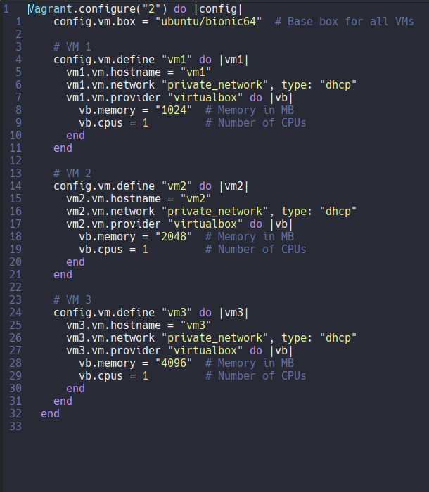
2. 🎯Task: Install k3s on all three machines. When installing, do not use the standard Ingress Controller by using the flag `--disable=traefik.` \
Created ansible playbook to automate this task.
3. 🎯Task: Connect the nodes to the cluster. Using ansible-playbook to install k3s on all nodes and connect worker nodes to the master node. Checking that all nodes are connected to the cluster: \
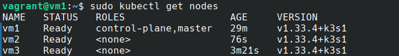
4. 🎯Task: Installing Nginx Ingress Controller. There is a detailed manual on nginx site: https://docs.nginx.com/nginx-ingress-controller/installation/installing-nic/installation-with-manifests. Automated this task with ansible \
Checking the installation: \
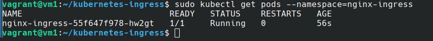
5. 🎯Task: Get a domain name and configure the cert-manager utility inside the cluster, which should generate a wildcard certificate for the obtained domain. \
My ISP is behind NAT, so k3s web app won't be reachable from the Internet. Getting domain name is pointless. Workaround: I edited /etc/hosts to create internal domain name which will work with self-signed certificate. Then installed Cert Manager. Tutorial: https://cert-manager.io/docs/installation/kubectl/. Checking the installation of cert-manager: \
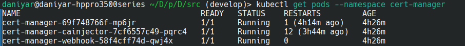
Then we need to install ClusterIssuer and certificate. Issuers, and ClusterIssuers, are Kubernetes resources that represent certificate authorities (CAs) that are able to generate signed certificates by honoring certificate signing requests. \
The first issuer, selfsigned-issuer, is a ClusterIssuer, which acts as the top-level authority to create the initial, self-signed root certificate. The second issuer, my-ca-issuer, is a namespaced Issuer that uses the root certificate created by the first issuer to sign other certificates for domain names.
The certificate chain works like this:
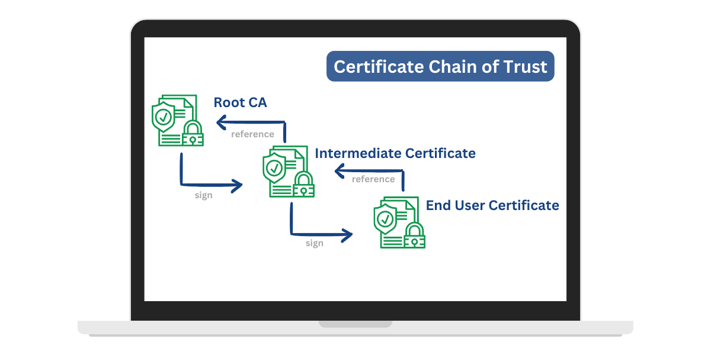
As a result, we should have something like this:
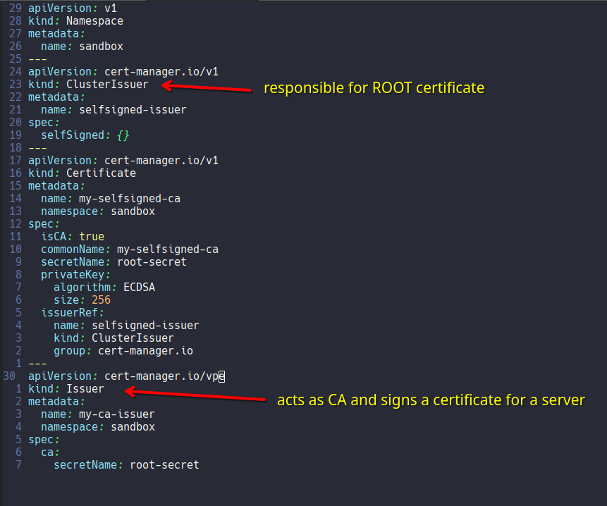
6. 🎯Task: Create an Ingress resource for your personal domain and configure it to use the nginx ingress controller and the obtained certificate.\
Tutorial: https://docs.nginx.com/nginx-ingress-controller/configuration/ingress-resources/basic-configuration. ❗NOTE: ingress should be in the same namespace as services and pods of the backend! ("nginx-ingress" by default)
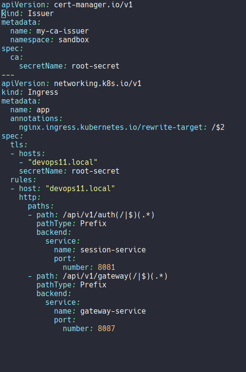
7. 🎯Task: Create a PV (Persistent Volume) for the PostgreSQL database in the manifest from the tenth project. \
Created Persisten Volume Claim. We don't need to create PV for local volume, because dynamic provisioner works by default.. PVC ready: \
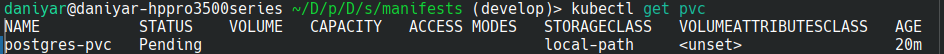
❗NOTE: for some reason k3s was not able to mount volume to default postgres data dir inside container. Downgrading from postgres:latest to postgres:16 solved the issue. The reason for this behaviour is unknown: 
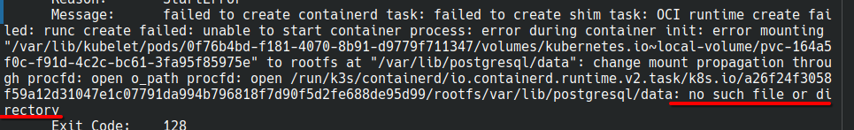
8. 🎯Task: Run the application described in the manifest. ❗NOTE: k3s uses flannel container network interface which picked up the first network interface of the host machines, which is NAT, so the pop-pod communication was failing. Used `--flannel-iface` flag to address the issue.
Applied manifest with the deployment:
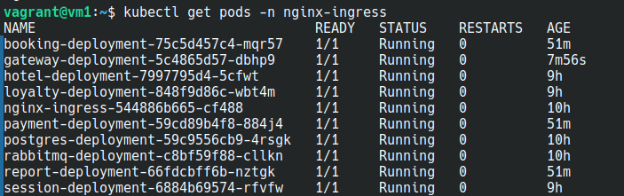
Also in order to make app accessible, we need to create service (nodePort type) for our nginx ingress container. Checking the accessibility of the app using our custom internal domain name: \
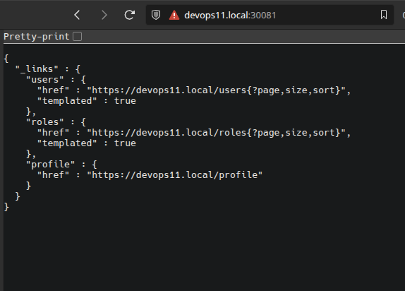
The certificate is present: \
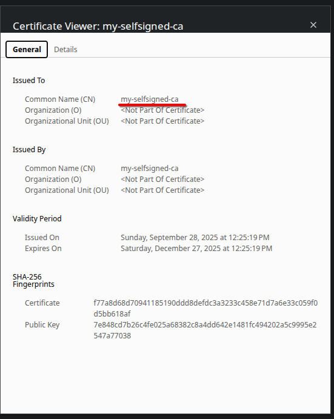
9. 🎯Task: Run postman functional tests and make sure that the application works.
❗NOTE: http request are blocked by default when TLS is used:\

We need to enable http (allow-http) and disable ssl-redirect in global config using `kubectl edit configmap [config] -n [namespace]` \
Running Postman test. Everything seems to work 🥳: \
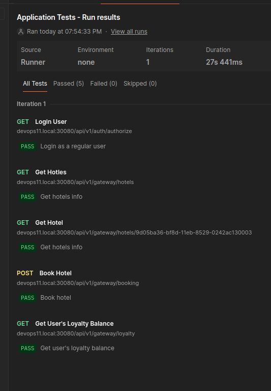
10. 🎯Task: Install and run Prometheus Operator to collect metrics in the system. \
Tutorial: https://prometheus-operator.dev/docs/getting-started/installation/#install-using-yaml-files
We need to install Kustomize to install prometheus operator in custom namespace. After that we should be able to see the operator pod: \
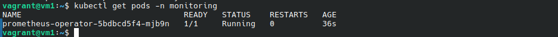
